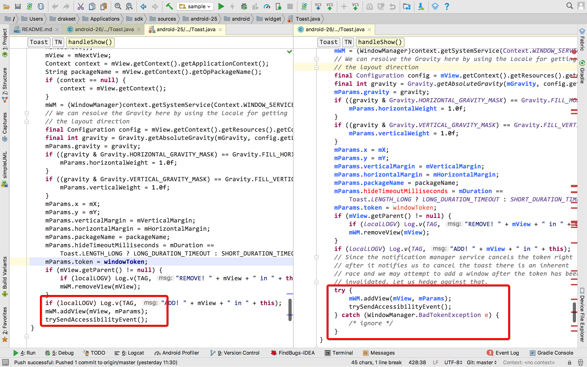

# ToastCompat

An Android library to hook and fix Toast **BadTokenException**

[](https://travis-ci.org/drakeet/ToastCompat)


### Usage

```groovy
implementation 'me.drakeet.support:toastcompat:1.1.0'
```

```java
ToastCompat.makeText(context, "hello world!", Toast.LENGTH_SHORT).show();
```

Or with `BadTokenListener#onBadTokenCaught(@NonNull Toast toast)`: 

```java
ToastCompat.makeText(this, "hello", Toast.LENGTH_SHORT)
    .setBadTokenListener(toast -> {
        ...
    }).show();
```

Goodbye, BadTokenException.

### Why

From API 25, Android added a new param `IBinder windowToken` for `Toast#handleShow()`, and It brought an exception. 
As Android said on API 26: 

```java
// Since the notification manager service cancels the token right
// after it notifies us to cancel the toast there is an inherent
// race and we may attempt to add a window after the token has been
// invalidated. Let us hedge against that.
```

So they try-catch the `mWM.addView(mView, mParams)` on API 26. **However, API 25 is still at risk. Our applications will continue to produce such an exception, and can not capture it**: 

```java
Fatal Exception: android.view.WindowManager$BadTokenException: 
Unable to add window -- token android.os.BinderProxy@1c4411f is not valid; is your activity running?
       at android.view.ViewRootImpl.setView(ViewRootImpl.java:679)
       at android.view.WindowManagerGlobal.addView(WindowManagerGlobal.java:342)
       at android.view.WindowManagerImpl.addView(WindowManagerImpl.java:94)
       at android.widget.Toast$TN.handleShow(Toast.java:459)
       at android.widget.Toast$TN$2.handleMessage(Toast.java:342)
       at android.os.Handler.dispatchMessage(Handler.java:102)
       at android.os.Looper.loop(Looper.java:154)
       at android.app.ActivityThread.main(ActivityThread.java:6236)
       at java.lang.reflect.Method.invoke(Method.java)
       at com.android.internal.os.ZygoteInit$MethodAndArgsCaller.run(ZygoteInit.java:891)
       at com.android.internal.os.ZygoteInit.main(ZygoteInit.java:781)
```

This exception occurs regardless of whether the `Context` you passed to `Toast` is an `Activity` or `ApplicationContext` or `Service`. And you can not `try-catch` it. 
 
 See the detail diff of **Android Toast sources**: 



### How

So I created this library, and replace the base Context to a `SafeToastContext`, it will hook the `WindowManagerWrapper.addView(view, params)` method and fix the exception. 


License
-------

    Copyright 2017 drakeet.

    Licensed under the Apache License, Version 2.0 (the "License");
    you may not use this file except in compliance with the License.
    You may obtain a copy of the License at

       http://www.apache.org/licenses/LICENSE-2.0

    Unless required by applicable law or agreed to in writing, software
    distributed under the License is distributed on an "AS IS" BASIS,
    WITHOUT WARRANTIES OR CONDITIONS OF ANY KIND, either express or implied.
    See the License for the specific language governing permissions and
    limitations under the License.
